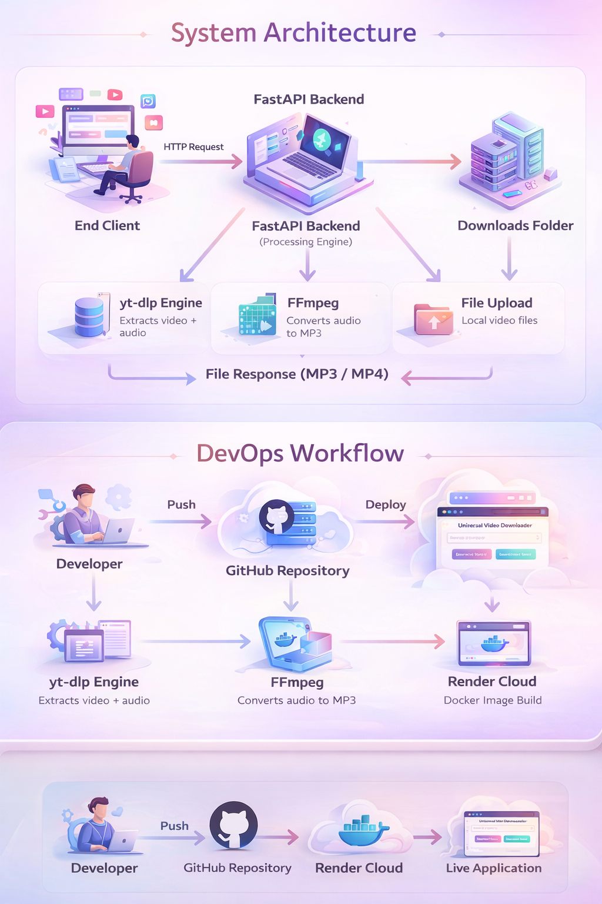

# 🚀 Universal Video Downloader (DevOps Powered)

---

## 📌 Overview

A full-stack, Dockerized, cloud-deployed web application that allows users to:

- 🎬 Download videos (MP4)
- 🎧 Extract audio (MP3)
- 🌍 Support multiple platforms:
  - YouTube
  - Instagram
  - Facebook
  - TikTok
  - Twitter (X)
  - 1000+ supported sites via yt-dlp
- 📤 Upload video from computer and convert to MP3

Built using:

**FastAPI + HTML/CSS + yt-dlp + FFmpeg + Docker + GitHub + Render**

---

# 🏗️ System Architecture

The image above represents the complete working structure of the system.

### 🔹 Flow Explanation

1. User enters video link or uploads file
2. FastAPI backend processes request
3. yt-dlp fetches video/audio
4. FFmpeg converts audio if required
5. File stored temporarily in downloads folder
6. FileResponse sends MP3/MP4 back to user

---

# 🔄 DevOps Workflow

### CI/CD Pipeline

1. Developer writes code
2. Git commit & push to GitHub
3. Render detects repository changes
4. Docker image builds automatically
5. Application deploys to cloud
6. Live application updates instantly

---

# 🧠 Tech Stack

| Layer | Technology |
|--------|------------|
| Backend | FastAPI |
| Frontend | HTML5 + CSS3 |
| Media Engine | yt-dlp |
| Audio Processing | FFmpeg |
| Containerization | Docker |
| Deployment | Render |
| Version Control | Git + GitHub |

---

# 🐳 Docker Usage

### Build Image
docker build -t video-downloader

### Run Container
docker run -p 8000:8000 video-downloader

---

# 🚀 Run Locally
git clone https://github.com/codersayan0/video-audio-devops.git  

cd video-downloader
pip install -r requirements.txt
uvicorn app:app --reload

Open: http://127.0.0.1:8000

---

# 🔥 Features

- Multi-platform video downloading
- MP3 extraction
- MP4 high-quality download
- Upload & convert local video
- Colorful modern UI
- Dockerized application
- CI/CD automated deployment

---

# ⚠️ Limitations

- Private videos cannot be downloaded
- Some platforms may require authentication
- Free hosting has memory/time limits

---

# 👨‍💻 Author

**Sayan Mandal**  
B.Tech Computer Science & Engineering Student  
Aspiring DevOps & Software Engineer  

---

# 🌟 Future Enhancements

- Progress bar while downloading
- Show video thumbnail before download
- Authentication system
- Auto-delete temporary files
- Kubernetes deployment
- Production-grade scaling with Nginx